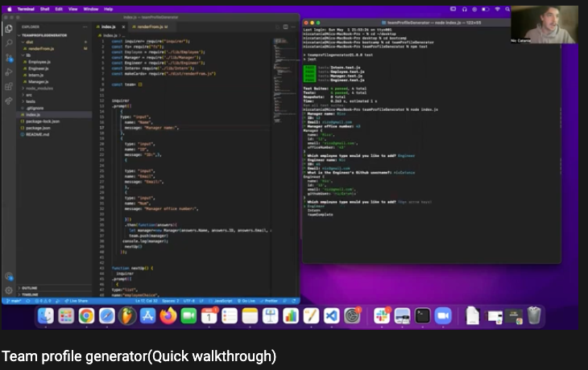
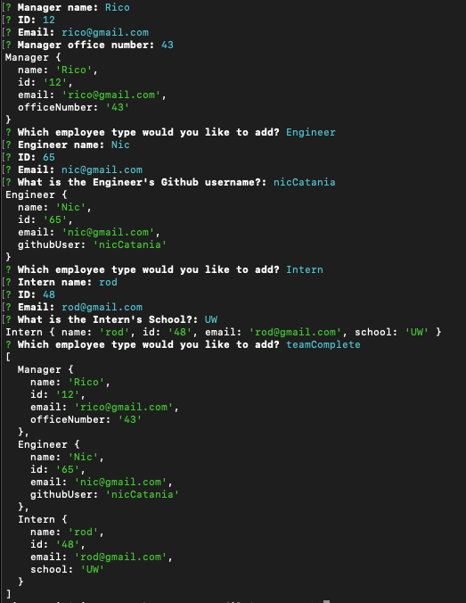
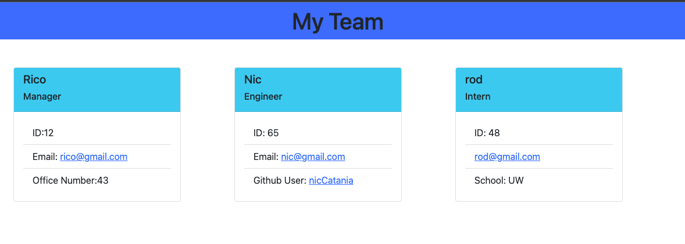
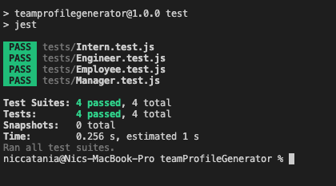

# Team Profie Generator

  

## Demonstration Video link

  https://youtu.be/k4AC5pZsnoM

  ### Table of Contents  

  [Description](#Description)

  [Usage](#Usage)  

  [Contributors](#Contributors) 

  [Tests](#Tests)  

  [License](#License) 

  [Questions](#Questions)  
  
  [Description](#Description) 
  

## Description:
This application will generate a website with a collection of cards showcasing your work team. Respond to prompts on the command line to generate a manager, and as many intern's and engineer's as you'd like. 
## Installation:
Download code. Run npm I to install the dependencies. 
## Usage:

This project uses HTML, Javascript, Node.js, inquirer NPM, and jest for testing
## Contributors:
Nic Catania
## Tests:

Jest 
## License
This project uses the MIT license.
## Questions
If you have any questions please contact me through github or email.
Github: https://github.com/Niccatania

Email: niccatania6@gmail.com
